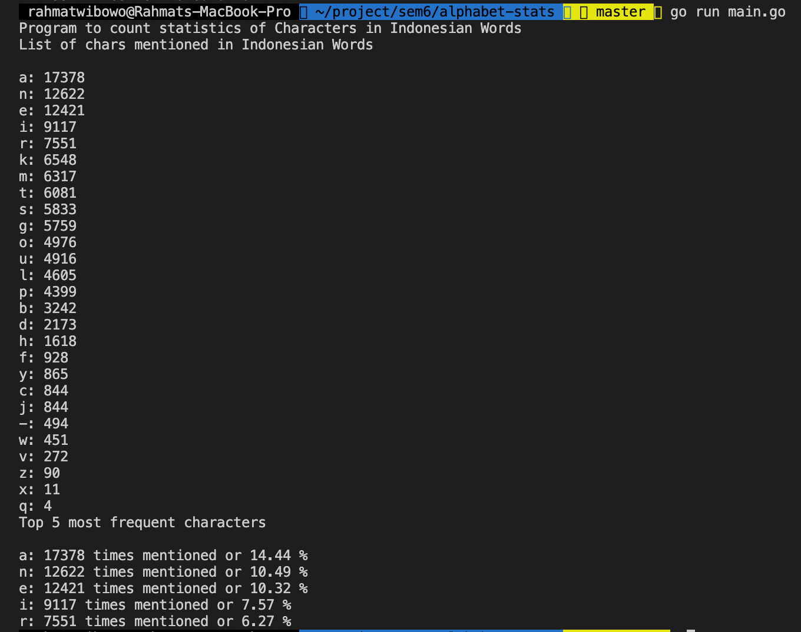

# Alphabet Stats

## Program Feature
CLI Program to count frequency of characters in Indonesian words from dictionary files in dictionary.txt. The program itself was made using Go Programming Language Because of its fast speed f excecution.

## Result

## Requirements
* Go 1.12 +

## Pre-installation
#### mac os: 
* brew install go

### How to Run
1. run command go run main.go
### Author
* Rahmat Wibowo / 18219040